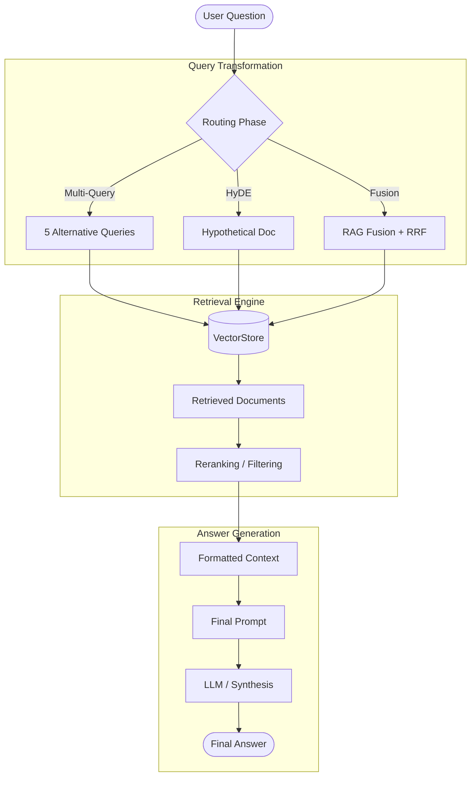
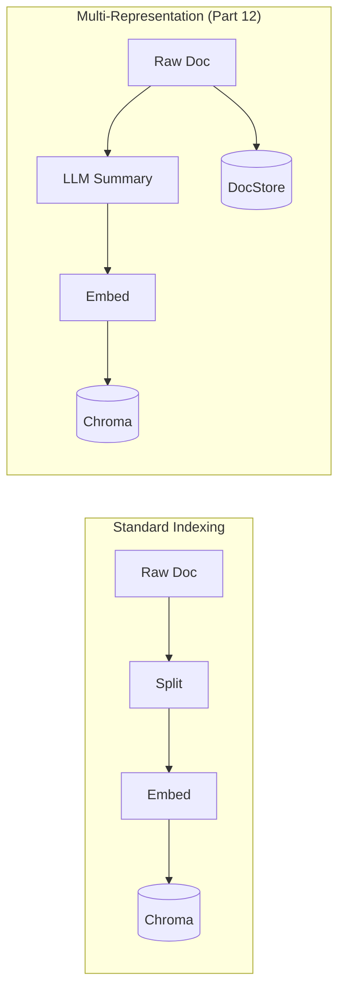

# 🎓 ragkit: Educational Deep-Dive

Welcome to the educational guide for `ragkit`. This document explains the architecture, the underlying RAG techniques, and how the various components of the toolkit work together to solve complex information retrieval problems.

---

## 🏗️ System Architecture

`ragkit` follows a modular, phase-based architecture. Instead of a monolithic "black box", the system is broken down into discrete stages that can be independently configured or swapped.

### 1. High-Level Pipeline Flow
The following diagram shows the standard lifecycle of a query within the system.

> [!TIP]
> **Why Modular?**
> By separating query translation from vector search, we can improve performance on "fuzzy" or "complex" questions that a standard vector search might miss.

---

## 📂 Module Deep-Dives

### 1. Indexing (`src/rag/indexing/`)
This module handles the transformation of raw data into a searchable index.

- **Loaders**: Fetch data from the web (BeautifulSoup) or YouTube (Transcript API).
- **Splitters**: Break long documents into chunks. We use `tiktoken` to ensure chunk sizes align with LLM token limits.
- **VectorStore**: Manages the storage and retrieval of embeddings using ChromaDB.

#### Standard vs. Multi-Representation Indexing

---

### 2. Query Translation (`src/rag/retrieval/`)
Most RAG failures occur because the user's question doesn't semantically match the stored chunks. `ragkit` implements several strategies to fix this:

| Strategy | Logic | Best For... |
|:---|:---|:---|
| **Multi-Query** | Generates 5 variations of the question to cover more semantic space. | Broad, vague questions. |
| **RAG-Fusion** | Generates queries + Ranks results via Reciprocal Rank Fusion. | High-precision requirements. |
| **HyDE** | Generates a *hypothetical* answer and uses *that* to search. | When question/answer gap is wide. |
| **Step-Back** | Abstracts the question to a higher-level concept first. | Questions requiring background knowledge. |

---

### 3. Routing (`src/rag/routing/`)
Routing allows the system to decide *how* to handle a query before processing it.

- **Logical Routing**: The LLM analyzes the query and picks the best datasource (e.g., "Python docs" vs. "JS docs").
- **Semantic Routing**: Uses embeddings to find the most similar prompt template or handler for a given query.

---

## 🛠️ Building & Setup

### Dependency Layers
`ragkit` uses optional dependency groups in `pyproject.toml` to keep the core lean.

- `dev`: Testing and Notebooks.
- `colbert`: Support for late-interaction retrieval.
- `rerank`: Support for Cohere's re-ranking engine.
- `youtube`: Support for video transcript processing.

> [!IMPORTANT]
> **Local First!**
> By default, `ragkit` is configured to use **LM Studio** at `http://localhost:1234/v1`. This allows you to learn and experiment without spending API credits.

---

## 🧭 Decision Matrix: Which Strategy to Use?

> [!NOTE]
> There is no "perfect" strategy. The best choice depends on your data and latency requirements.

- **Low Latency**: Use `naive` or `semantic routing`.
- **High Accuracy (Complex Data)**: Use `rag_fusion` or `multi_query`.
- **Structured Data**: Use `query_structuring` to apply metadata filters.
- **Large Context**: Use `reranking` to narrow down 20+ docs to the top 3 most relevant ones.

---

*Happy Learning!* 🚀
