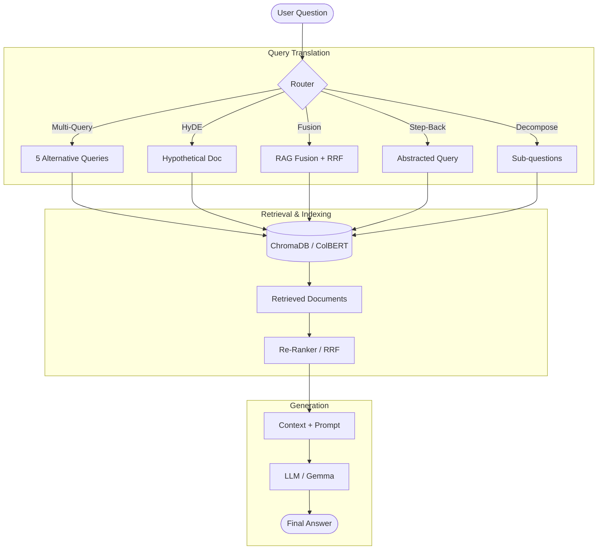

# 🚀 ragkit

**A professional, modular toolkit covering every RAG technique — from naive baselines to advanced agentic flows.**

`ragkit` transforms educational RAG concepts into a production-ready Python package. Each technique is implemented as a composable module, allowing you to swap retrieval strategies, experiment with advanced indexing, and run everything locally with high-performance LLMs.

---

## 🏗️ Architecture

The following diagram visualizes the modular flow of the `ragkit` pipeline, from query ingestion to final answer synthesis.



---

## 📂 Project Structure

The codebase is organized logically by RAG phase, making it easy to extend or extract specific components.

```
src/rag/
├── indexing/          # Document loading, splitting, and vectorstore management
├── retrieval/         # Advanced retrieval strategies (Multi-query, RRF, HyDE)
├── generation/        # Prompt templates and RAG chains
├── routing/           # Logical and semantic query routing
├── query/             # Query analysis and structuring for metadata filters
├── pipeline/          # Unified runner and CLI entry point
└── config.py          # Centralized configuration (LM Studio / OpenAI)
```

---

## 🛠️ Techniques Covered

| Phase | Techniques |
|:---|:---|
| **Fundamentals** | Naive RAG, Tiktoken Splitting, ChromaDB integration |
| **Translation** | Multi-Query, RAG-Fusion, Step-Back, HyDE, Decomposition |
| **Routing** | Logical (LLM-based) and Semantic (Embedding-based) Routing |
| **Indexing** | Multi-Representation Indexing, ColBERT (via RAGatouille) |
| **Retrieval** | Reciprocal Rank Fusion (RRF), Cohere Re-Ranking |
| **Advanced** | CRAG & Self-RAG (documented via LangGraph) |

---

## 🚀 Quick Start

### 1. Installation
```bash
git clone https://github.com/quangvnai/ragkit
cd ragkit
pip install -e ".[dev,colbert,rerank,youtube]"
```

### 2. Configuration
Copy the example environment file and add your API keys (optional if using LM Studio).
```bash
cp .env.example .env
```

### 3. Run the CLI
Use the unified runner to test any strategy against a target URL:
```bash
# Naive RAG
python -m rag.pipeline.runner --question "What is task decomposition?"

# RAG-Fusion strategy
python -m rag.pipeline.runner --strategy rag_fusion --question "How do agents use memory?"
```

---

## 🧪 Testing

We use `pytest` for all unit tests. Mocks are used to ensure tests run offline without API calls.

```bash
pytest
```